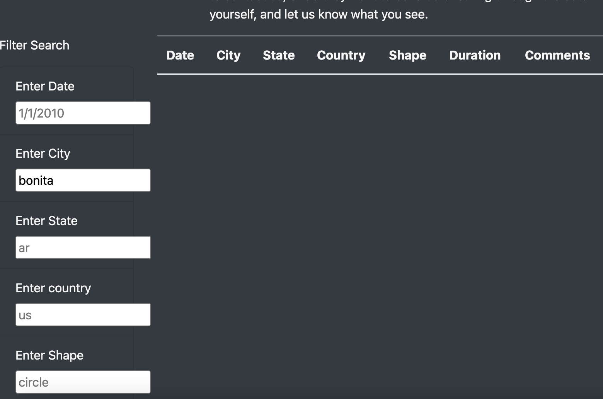
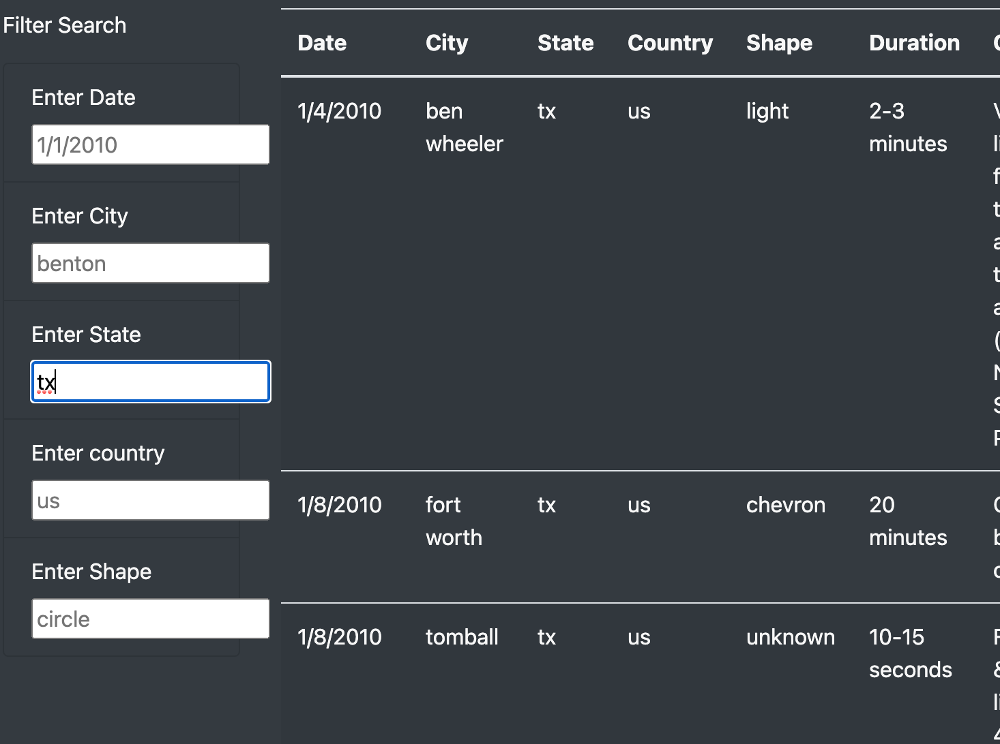

# UFOs
## Overview of Analysis
After creating a webpage and table of UFO sightings, I was tasked with adding filters to the table for the city, state, country and shape for the UFO sightings. These filters allow users to interact with and filter the data as they choose. This dynamic table will allow for us to perform in-depth analysis. 

## Results
### How to use the webpage
The webpage I have created is extremely user friendly. When visiting the page, the user will see the table in the bottom half of the page. In order to filter the data, they simply have to fill in the input box of the appropriate filter and press enter. I have created 5 filters for users to sort the data by: date, city, state, country, and shape. For example, if someone wanted to filter the data by a specific date like 1/13/2010 we would follow the specifc format of the preview text in the input box and press enter to return the values pictured below. 

See below an additional example using the table to filter UFO sightings by state. In the below image I put in "TX" to show UFO sightings in Texas. 

## Summary
### Drawback
One limitation of the webpage I have created is that we do not have a filter option for the duration. This one may have been more difficult as the format may have been more inconsistent with the options for seconds/minutes/hours. It would be useful to provide options for the user to choose the inputs for this filter if I did decide to add the duration filter. 
### Additional recommendations
It may be useful to provide a drop down list of options for the user to choose. For example, for shape it may be useful to provide options for the user to pick from. Allowing for multiple filters in one category would also be useful
